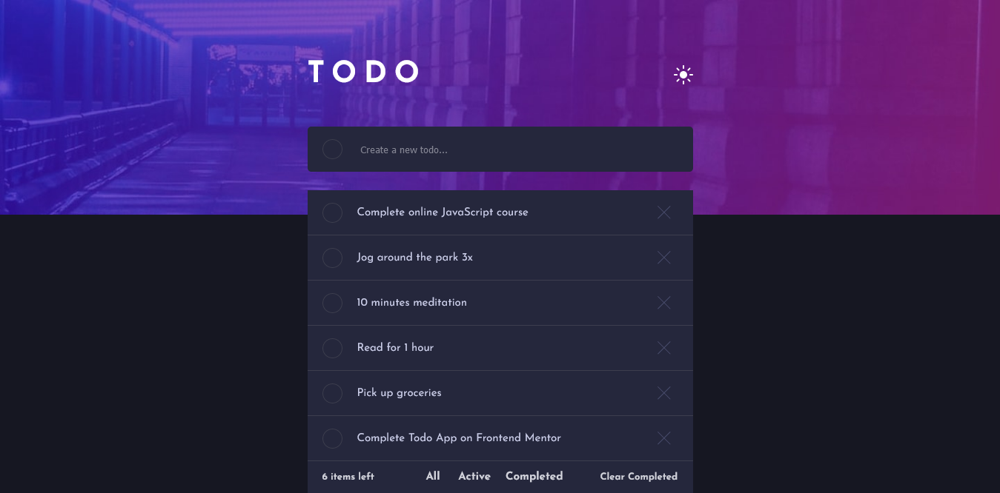
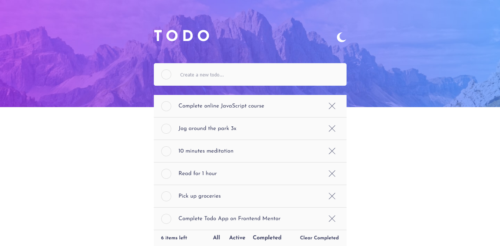

# Frontend Mentor - Todo app solution

This is a solution to the [Todo app challenge on Frontend Mentor](https://www.frontendmentor.io/challenges/todo-app-Su1_KokOW). Frontend Mentor challenges help you improve your coding skills by building realistic projects.

## Table of contents

- [Overview](#overview)
  - [The challenge](#the-challenge)
  - [Screenshot](#screenshot)
  - [Links](#links)
- [My process](#my-process)
  - [Built with](#built-with)
  - [What I learned](#what-i-learned)
  - [Continued development](#continued-development)
  - [Useful resources](#useful-resources)
- [Author](#author)
- [Acknowledgments](#acknowledgments)

## Overview

### The challenge

Users should be able to:

- View the optimal layout for the app depending on their device's screen size
- See hover states for all interactive elements on the page
- Add new todos to the list
- Mark todos as complete
- Delete todos from the list
- Filter by all/active/complete todos
- Clear all completed todos
- Toggle light and dark mode
- **Bonus**: Drag and drop to reorder items on the list

### Screenshot

### Links

- Solution URL: [Add solution URL here](https://github.com/djiby26/todo-app-frontEnd-mentor)
- Live Site URL: [Add live site URL here](https://your-live-site-url.com)

## My process

### Built with

- [React](https://reactjs.org/) - JS library
- Beautiful DND(For the drag and drop)
- Used Hooks,Context,States ...
- JSX
- CSS
- Flexbox

### What I learned

- Use spread operator
- How to use useSate in React
- How to implement vertical drag and drop with Beautiful DND
- How to share state between components using context or by lifting the state up.

### Continued development

- I would like to explore more react functionality

### Useful resources

- [React Doc](https://reactjs.org)
- [Beautiful DND](https://github.com/atlassian/react-beautiful-dnd)
- [Stack OverFlow](https://stackoverflow.com/)
- [And many others😜]('')

## Author

- Frontend Mentor - [@djiby26](https://www.frontendmentor.io/profile/djiby26)
- Facebook - [@jeeby.ndn](https://web.facebook.com/jeeby.ndn/)
